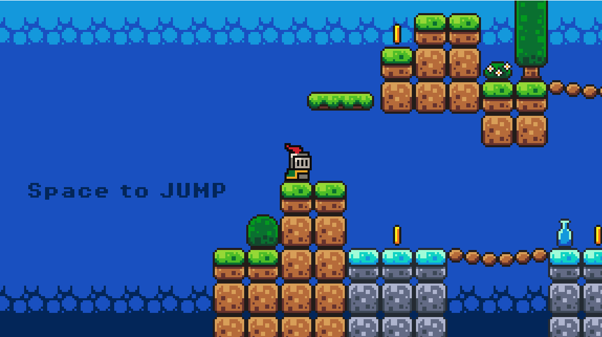
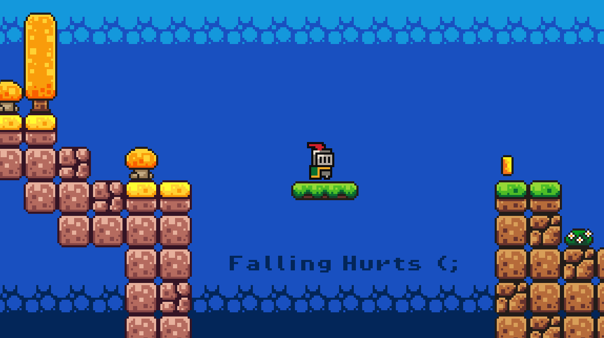
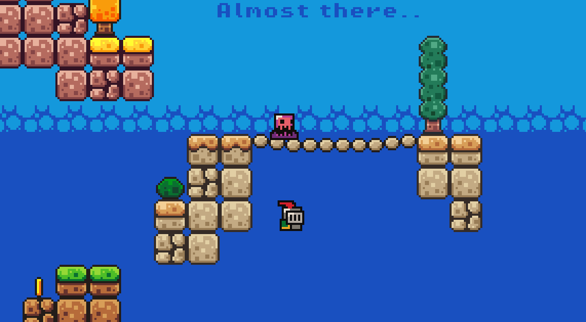
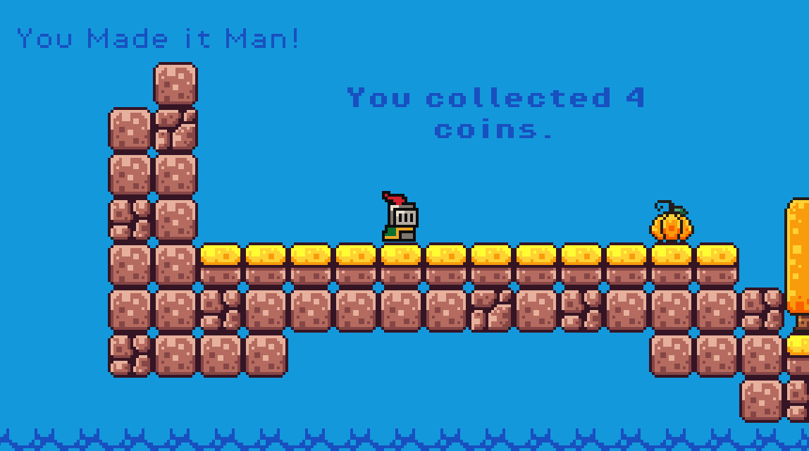

## 🛡️ Last Dragon Princess: The Pixel Odyssey ⚔️

🚀 Play the Game
Ready to enter the simulation? You can download the latest executable directly from the Releases page.

[📦 Download (Windows.exe)](https://github.com/U7-lab/Last_Dragon_Princess/releases/tag/v1.0)

*Note:* Look for the `.exe` file under the *Assets* section of the latest Tag/Release! 🎮

## 📸 Gallery

  
   

This Game is a vibrant, 8-bit platformer where retro charm meets a modern meta-twist. Navigate a pixel-perfect world, dodge squishy slimes, and outsmart mysterious wizards to uncover the secrets hidden in the code.

  
   

## 🌟 Game Overview
Embark on a journey through a lush, tropical landscape as a brave little knight. This isn't just another walk in the park—you'll need precision, timing, and a bit of "debugging" luck to survive the traps and enemies lurking in the pixels.

  
   

## ✨ Key Features
🕹️ Classic Action: Tight, challenging 2D platforming mechanics.
🎨 Retro Vibes: Beautifully crafted pixel art with swaying palms.
👾 Deadly Foes: Battle jumpy slimes 🟢 and phantom wizards 🧙‍♂️.
🪙 Loot & Glory: Collect gold coins to prove your mastery.
💻 The Glitch: A meta "Debug" narrative—is the world breaking?

  
   

## 🎮 How to Play

| Action | Control |
| :--- | :--- |
| **Move** | `Arrow Keys` |
| **Jump** | `Spacebar` |

## 🛠️ Technical Stack
*Language:* [GDScript]
*Engine/Framework:* [Godot]
*Art Tools:* [Pixel Art]
